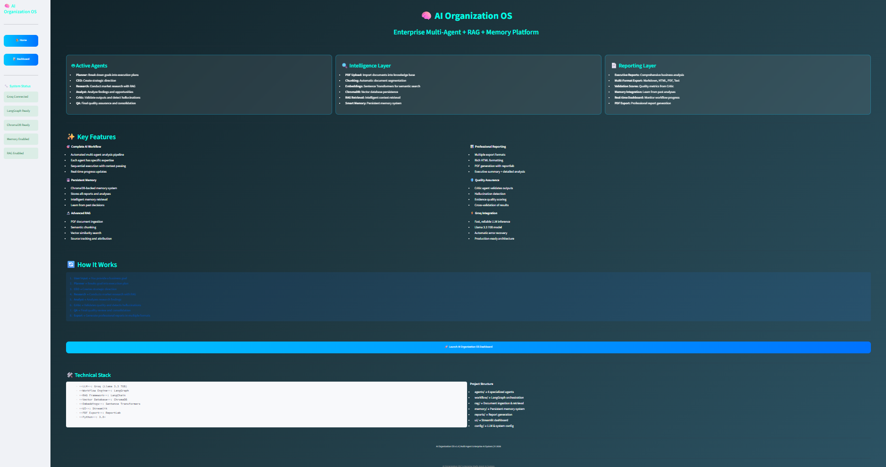
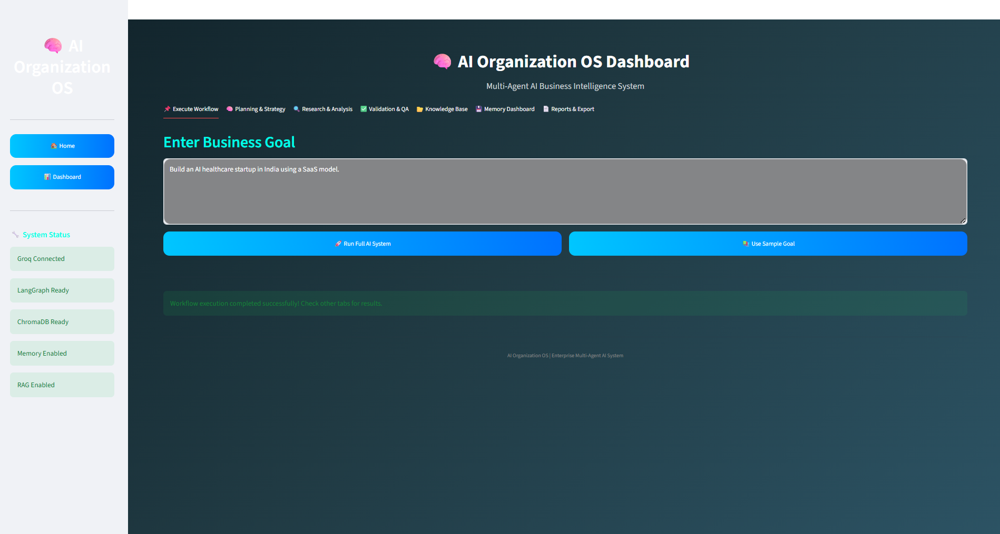
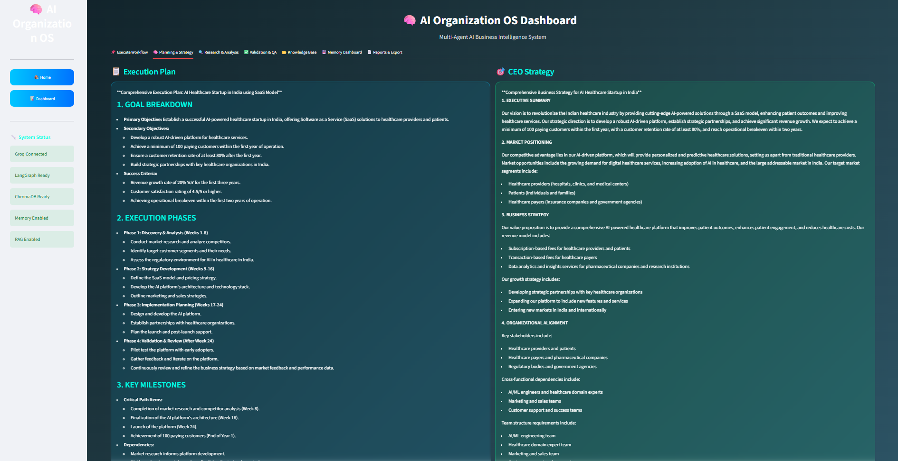
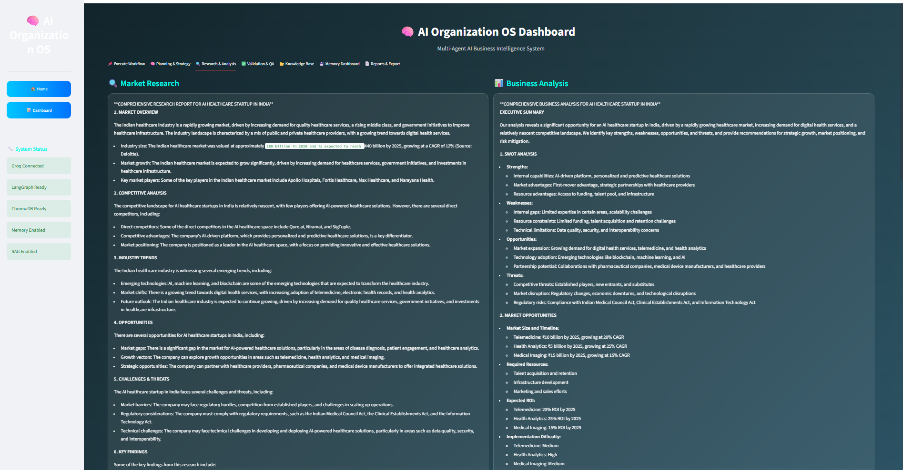
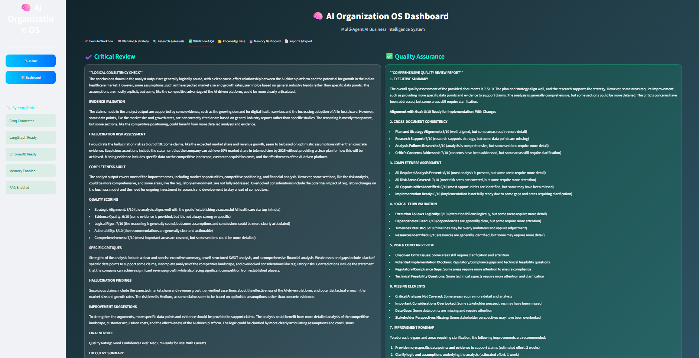
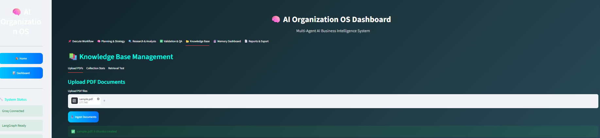
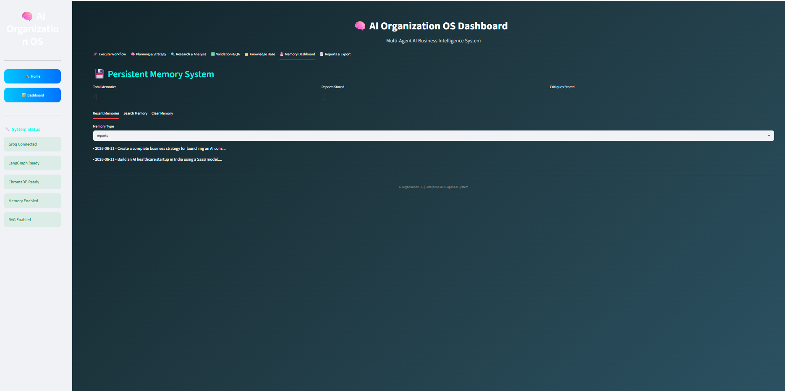
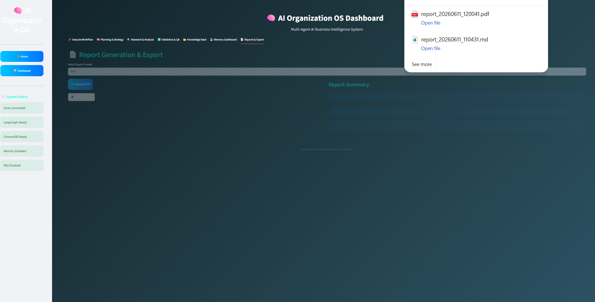

# 🚀 AI Organization OS

<h3 align="center">
Enterprise Multi-Agent AI Operating System
</h3>

<p align="center">
Automated Business Strategy • Market Research • Analysis • Reporting
</p>

<p align="center">
  
  
  
  
  
</p>

---

## ✨ Overview

AI Organization OS is a production-ready multi-agent AI platform that transforms business goals into actionable strategies, research insights, validation reports, and executive-ready deliverables.

Built with LangGraph, Groq LLMs, ChromaDB, and Retrieval-Augmented Generation (RAG).

---

## 🏗️ Architecture

```text
User Goal
    │
    ▼
Planner Agent
    │
    ▼
CEO Agent
    │
    ▼
Research Agent (RAG)
    │
    ▼
Analyst Agent
    │
    ▼
Critic Agent
    │
    ▼
QA Agent
    │
    ▼
Professional Report
```

---

## 🤖 Multi-Agent System

| Agent    | Responsibility                          |
| -------- | --------------------------------------- |
| Planner  | Goal decomposition & execution planning |
| CEO      | Business strategy generation            |
| Research | Market & document intelligence          |
| Analyst  | Opportunity and risk analysis           |
| Critic   | Validation & hallucination detection    |
| QA       | Final review & report consolidation     |

---

## 🔥 Key Features

### Multi-Agent Intelligence

* LangGraph orchestration
* Specialized AI agents
* Cross-agent validation

### RAG Knowledge Engine

* PDF ingestion
* Semantic chunking
* Vector search with ChromaDB
* Context-aware retrieval

### Persistent Memory

* Long-term memory storage
* Semantic memory search
* Historical insight reuse

### Report Generation

* Markdown
* HTML
* PDF
* Text Export

### Quality Assurance

* Hallucination detection
* Evidence validation
* Consistency checking

---

<h2 align="center">📸 Application Screenshots</h2>

<table align="center">
  <tr>
    <td align="center">
      <h4>🏠 Home</h4>
      
    </td>
    <td align="center">
      <h4>🚀 Workflow Execution</h4>
      
    </td>
  </tr>

  <tr>
    <td align="center">
      <h4>📋 Planning & Strategy</h4>
      
    </td>
    <td align="center">
      <h4>🔎 Research & Analysis</h4>
      
    </td>
  </tr>

  <tr>
    <td align="center">
      <h4>🛡️ Validation & QA</h4>
      
    </td>
    <td align="center">
      <h4>📚 Knowledge Base</h4>
      
    </td>
  </tr>

  <tr>
    <td align="center">
      <h4>🧠 Memory Dashboard</h4>
      
    </td>
    <td align="center">
      <h4>📄 Reports & Export</h4>
      
    </td>
  </tr>
</table>

## ⚙️ Tech Stack

| Layer           | Technology            |
| --------------- | --------------------- |
| AI Framework    | LangGraph             |
| LLM Provider    | Groq                  |
| Vector Database | ChromaDB              |
| Embeddings      | Sentence Transformers |
| Frontend        | Streamlit             |
| Reports         | ReportLab             |
| Language        | Python                |

---

## 🚀 Quick Start

### Installation

```bash
git clone https://github.com/chandraprabhaa/AI-Organization-OS.git

cd ai-organization-os

pip install -r requirements.txt
```

### Environment

```env
GROQ_API_KEY=your_api_key
```

### Run

```bash
streamlit run app.py
```

Open:

```text
http://localhost:8501
```

---

## 📂 Project Structure

```text
ai_organization_os/
│
├── agents/                    # 6 specialized AI agents
│   ├── planner_agent.py      # ✓ Execution planning
│   ├── ceo_agent.py          # ✓ Strategic planning
│   ├── research_agent.py     # ✓ Market research with RAG
│   ├── analyst_agent.py      # ✓ Business analysis
│   ├── critic_agent.py       # ✓ Validation & quality
│   └── qa_agent.py           # ✓ Final QA review
│
├── workflow/                  # LangGraph orchestration
│   └── graph.py              # ✓ Complete workflow graph
│
├── rag/                       # RAG system
│   ├── ingest.py             # ✓ PDF ingestion
│   ├── retriever.py          # ✓ Document retrieval
│   └── chroma_db/            # Vector database
│
├── memory/                    # Persistent memory
│   └── persistent_memory.py  # ✓ ChromaDB-backed memory
│
├── reports/                   # Report generation
│   ├── generator.py          # ✓ Report data models
│   └── pdf_export.py         # ✓ PDF generation
│
├── ui/                        # Streamlit interface
│   ├── home.py               # ✓ Home page
│   └── streamlit_ui.py       # ✓ Main dashboard
│
├── config/                    # Configuration
│   └── llm.py                # ✓ LLM setup
│
├── utils/                     # Utilities
│   ├── config.py             # ✓ System configuration
│   ├── logger.py             # ✓ Logging
│   └── text_cleaner.py       # ✓ Text processing
│
├── app.py                     # ✓ Main entry point
├── requirements.txt           # ✓ Dependencies
├── .env                       # ✓ Configuration
└── README.md                  # Documentation
```

---

## ⭐ Highlights

* 6 Specialized AI Agents
* LangGraph Workflow Engine
* RAG-Powered Research
* Persistent Memory System
* Enterprise Report Generation
* Professional Dashboard
* Hallucination Detection
* ChromaDB Integration

---

<p align="center">
Built for Enterprise AI Automation
</p>
